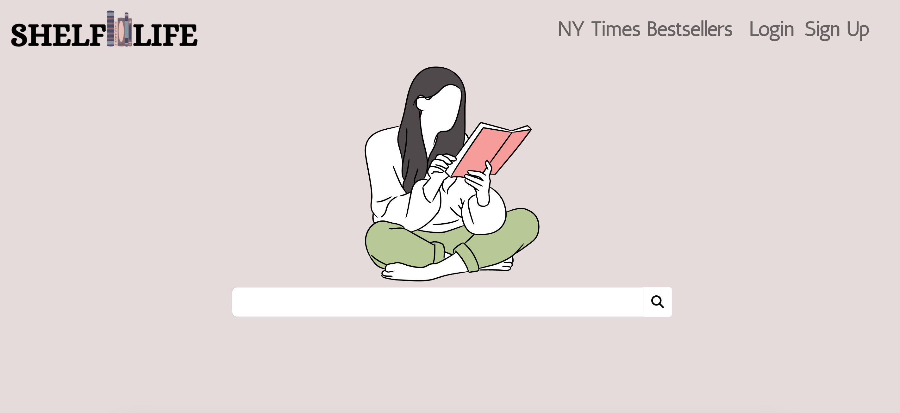

# Shelf Life

## Description
This web application allows a book lover to search and save their favorite or must-read books to their online bookshelf. Users have the ability to login, sign-up, search through thousands of books, and save books into their own collection with this responsive web application.

## Usage
To use this program view the deployed [Shelf Life App](https://floating-anchorage-57959.herokuapp.com/).

**Here's a screenshot of the application:**

## License
This project is licensed under [The ISC License](https://opensource.org/licenses/ISC)

